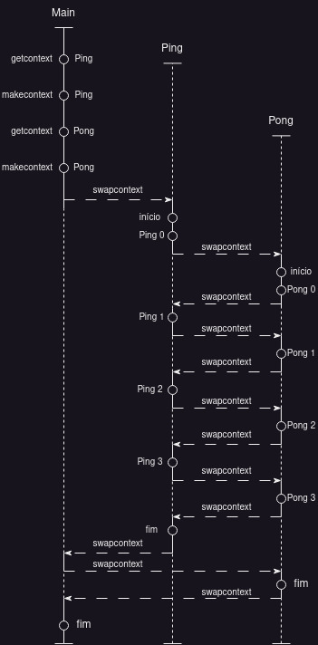

# Project 01: Contexts

## 1 - Explique o objetivo e os parâmetros de cada uma das quatro funções acima.

A estrutura `ucontext_t` armazena informções sobre contextos 
```c
typedef struct ucontext_t {
    struct ucontext_t *uc_link;
    sigset_t uc_sigmask;
    stack_t uc_stack;
    mcontext_t uc_mcontext;
    ...
} ucontext_t;
```

* `int getcontext(ucontext_t *ucp)`:
    * `parâmetro`: endereço de uma variável do tipo **ucontext_t**
    * `ação`: captura o contexto atual e salva na variável **ucp**


* `int setcontext(const ucontext_t *ucp)`:
    * `parâmetro`: endereço de uma variável do tipo **ucontext_t**
    * `ação`: restaura as informações de um contexto previamente salvo em **ucp**

* `int swapcontext(ucontext_t *oucp, const ucontext_t *ucp)`: 
    * `parâmetro`: dois endereços de variáveis do tipo **ucontext_t**
    * `ação`: salva o contexto atual na variavel **oucp** e restaura (ativa) o contexto salvo anteriormente em **ucp**. Basicamente, realiza a troca dos contextos de **oucp** e **ucp**. 

* `void makecontext(ucontext_t *ucp, void (*func)(), int argc, ...)`: 
    * `parâmetro`: endereço de uma variável do tipo **ucontext_t**
    * `ação`: ajusta alguns valores internos  do contexto salvo em **ucp**, como por exemplo setar uma funcao que deve ser executada nele.


## 2 - Explique o significado dos campos da estrutura ucontext_t que foram utilizados no código.

* `ContextPong.uc_stack.ss_sp`: aponta para o inicio da sinal *stack*
* `ContextPong.uc_stack.ss_size`: armazena o tamanho da sinal *stack* apontada por .ss_sp
* `ContextPong.uc_stack.ss_flags`:  contém o *bitwise* ou as *flags* **SS_DISABLE** (diz ao sistema que não deve usar a sinal *stack*) ou **SS_ONSTACK** (setado pelo sistema, e indica que a sinal *stack* está em uso atualmente. Se não tiver setado, os sinais sao entregues na normal user *stack*)
* `ContextPong.uc_link`: ponteiro para a proxima estrutura de contexto, que é usada se o contexto descrito na estrutura atual retorna

## 3 - Explique cada linha do código de contexts.c que chame uma dessas funções ou que manipule estruturas do tipo ucontext_t.

```c
// line 33
swapcontext (&ContextPing, &ContextPong) ;
```
Troca de contexto. Salva o contexto de Ping e ativa o de Pong.

```c
// line 37
swapcontext (&ContextPing, &ContextPong) ;
```
Troca de contexto. Salva o contexto de Ping e ativa o de Main.

* O procedimento é análogo nas linhas **51** e **55**.

```c
// line 66
getcontext (&ContextPing) ;
```
Salva contexto atual em Ping.

```c
// lines 71 to 74 
ContextPing.uc_stack.ss_sp = stack ;
ContextPing.uc_stack.ss_size = STACKSIZE ;
ContextPing.uc_stack.ss_flags = 0 ;
ContextPing.uc_link = 0 ;
```

Configuta os valores da pilha para o contexto que está em Ping

```c
// line 82
makecontext (&ContextPing, (void*)(*BodyPing), 1, "    Ping") ;
```
Adiciona o comportamento da função **BodyPing** no contexto de Ping.

* A linha **84** é análoga à linha **66** para Pong
* O bloco iniciado na linha **89** é análogo ao bloco iniciado na linha **71** para Pong 

```c
// lines 102 and 103
swapcontext (&ContextMain, &ContextPing) ;
swapcontext (&ContextMain, &ContextPong) ;
```

Salva o contexto de **Main** e troca para **Ping**, depois salva o contexto de **Main** e troca para **Pong**

## 4 - Para visualizar melhor as trocas de contexto, desenhe o diagrama de tempo dessa execução.



* description: https://wiki.inf.ufpr.br/maziero/doku.php?id=so:trocas_de_contexto