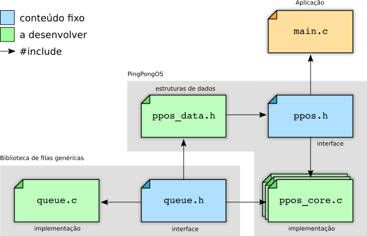
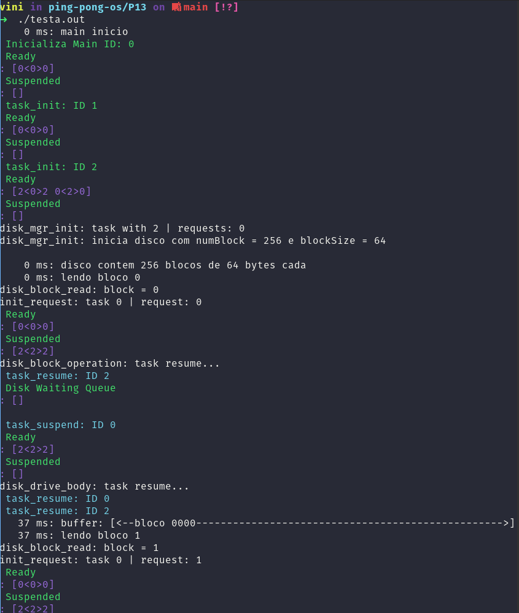

# PingPongOS

## About

This project was created by [Professor Carlos A. Maziero](https://wiki.inf.ufpr.br/maziero/doku.php?id=so:pingpongos) aims to construct, incrementally, a small didactic operating system. The system is initially built in the form of a cooperative thread library within a real operating system process (Linux, macOS, or another Unix).

The development is incremental, gradually adding functionalities such as preemption, accounting, semaphores, message queues, and access to a virtual disk. This approach simplifies the development and debugging of the kernel, as well as eliminates the need for machine language.

The overall structure of the code to be developed is presented in the figure below. The files in blue are fixed (provided by the professor), while the files in green should be developed by the students.

## Projects

Each project P00 to P13 is a new feature added to the operating system. The projects are:

* P00: [Queue Library](./P00)
* P01: [Context Switch](./P01)
* P02: [Tasks Management](./P02)
* P03: [Dispatcher](./P03)
* P04: [Scheduler](./P04)
* P05: [Preemption](./P05)
* P06: [Timer](./P06)
* P07: [Main Task](./P07)
* P08: [Suspended Tasks](./P08)
* P09: [Sleeping Tasks](./P09)
* P10: [Semaphores](./P10)
* P11: [Barrier](./P11)
* P12: [Message Queue](./P12)
* P13: [Virtual Disk](./P13)

