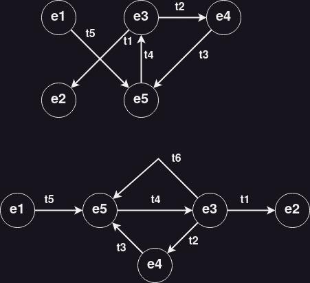

# Exercícios Capítulo 3

## 1 - O que significa *time sharing* e qual a sua importância em um sistema operacional?

Após solucionar o problema da ociosidade do processador, a técnica de tempo compartilhado foi criada para solucionar a monopolização da CPU por alguma tarefa (ex: laço infinito).

Nessa solução, para cada tarefa que recebe o processador é definido um prazo de processamento, denominado fatia de tempo ou *quantum* . Esgotado seu quantum, a tarefa em execução perde o processador e volta para uma fila de tarefas “prontas”, que estão na memória aguardando sua oportunidade de executar, e outra tarefa é ativada.

## 2 - Como e com base em que critérios é escolhida a duração de um quantum de processamento?

A duração do quantum de processamento é escolhida com base em critérios como tempo de resposta, overhead do sistema, throughput do sistema, número de processos e tipo de aplicação. Geralmente, a duração do quantum é ajustada dinamicamente pelo sistema operacional com base na carga de trabalho do sistema e no comportamento dos processos em execução.

## 3 - Considerando o diagrama de estados dos processos apresentado na figura a seguir, complete o diagrama com a transição de estado que está faltando (t6) e apresente o significado de cada um dos estados e transições.

### Estados
* `E1`: novo
* `E2`: finalizado
* `E3`: executando
* `E4`: suspenso
* `E5`: pronto

### Transições
* `T1`: execução finalizada
* `T2`: espera por dados, evento ou tempo
* `T3`: espera finalizada, pode concluir
* `T4`: recebe o processador
* `T5`: pronto para executar
* `T6`: tempo de preempção

## 4 - Indique se cada uma das transições de estado de tarefas a seguir definidas é possível ou não. Se a transição for possível, dê um exemplo de situação na qual ela ocorre (N: Nova, P: pronta, E: executando, S: suspensa, T: terminada).

* `E -> P`: esta transição ocorre quando se esgota a fatia de tempo destinada à tarefa (ou seja, o fim do quantum); como nesse momento a tarefa não precisa de outros recursos além do processador, ela volta à fila de tarefas prontas até recebê-lo novamente.
* `E -> S`: caso a tarefa em execução solicite acesso a um recurso não disponível, como dados externos ou alguma sincronização, ela abandona o processador e fica suspensa até o recurso ficar disponível.
* `S -> E`: **NÃO** ocorre. Uma tarefa suspensa apenas pode voltar a ficar pronta e deve aguardar o processador.
* `P -> N`: **NÃO** ocorre. Não faz sentido.
* `S -> T`: **NÃO** ocorre. Deve passar para pronta e executando antes de terminar.
* `E -> T`: ocorre quando a tarefa encerra sua execução ou é abortada em consequência de algum erro (acesso inválido à memória, instrução ilegal, divisão por zero, etc.). Na maioria dos sistemas a tarefa que deseja encerrar avisa o sistema operacional através de uma chamada de sistema (no Linux é usada a chamada exit).
* `N -> S`: **NÃO** ocorre. Deve passar por pronta e executando antes.
* `P -> S`: **NÃO** ocorre. Deve passar por executando antes.

## 5 - Relacione as afirmações abaixo aos respectivos estados no ciclo de vida das tarefas (N: Nova, P: Pronta, E: Executando, S: Suspensa, T: Terminada):

* [N] O código da tarefa está sendo carregado.
* [P] A tarefas são ordenadas por prioridades.
* [E] A tarefa sai deste estado ao solicitar uma operação de entrada/saída.
* [T] Os recursos usados pela tarefa são devolvidos ao sistema.
* [P] A tarefa vai a este estado ao terminar seu quantum.
* [P] A tarefa só precisa do processador para poder executar.
* [S] O acesso a um semáforo em uso pode levar a tarefa a este estado.
* [N] A tarefa pode criar novas tarefas.
* [E] Há uma tarefa neste estado para cada processador do sistema.
* [S] A tarefa aguarda a ocorrência de um evento externo.
