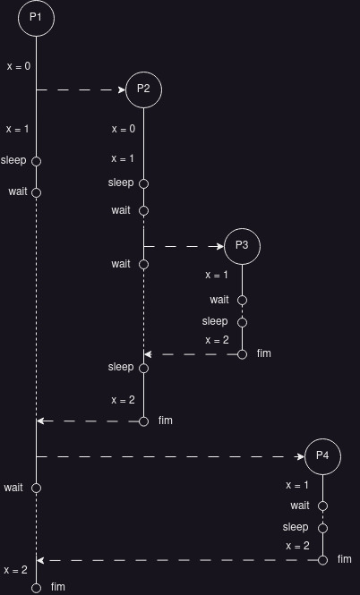
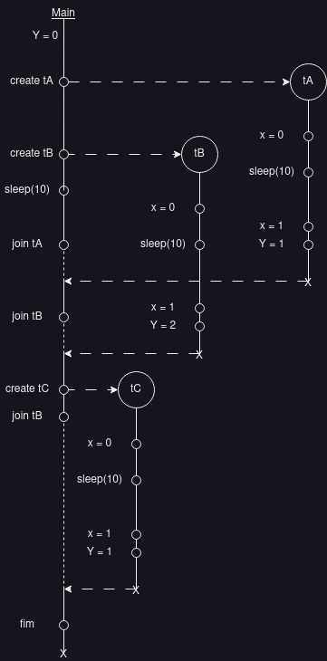

# Exercícios Capítulo 5 

O estado de uma tarefa em um determinado
instante é denominado **contexto**.

O ato de suspender uma tarefa e reativar outra é denominado uma **troca de contexto**.

**Despachante** ou executivo (*dispatcher*) é um conjunto de rotinas que provê armazenamento e recuperação do contexto e a atualização das informações contidas no TCB de cada tarefa. `Mecanismos`

**Escalonador** (*scheduler*) responsável pela escolha da próxima tarefa a receber o processador a cada troca de contexto. Considera influências de diversos fatores, como as prioridades, os tempos de vida e os tempos de processamento restante de cada tarefa. `Política`

## 1 - Explique o que é, para que serve e o que contém um TCB - Task Control Block

TCB é um descritor, ou seja, uma estrutura de dados no núcleo que representa essa tarefa. Nessa estrutura de dados são armazenadas as informações relativas ao seu contexto e os demais dados necessários à sua gerência, como prioridades, estado, etc

## 2 - Desenhe o diagrama de tempo da execução do código a seguir, informe qual a saída do programa na tela (com os valores de x) e calcule a duração aproximada de sua execução.

```c
int main() {
    int x = 0 ;
    fork () ;
    x++ ;
    sleep (5) ;
    wait (0) ;
    fork () ;
    wait (0) ;
    sleep (5) ;
    x++ ;
    printf ("Valor de x: %d\n", x) ;
}
```



## 3 - Indique quantas letras “X” serão impressas na tela pelo programa abaixo quando for executado com a seguinte linha de comando: 

```bash
a.out 4 3 2 1 
```

## O comando a.out resulta da compilação do programa a seguir:

```c
#include <stdio.h>
#include <sys/types.h>
#include <unistd.h>
#include <stdlib.h>

int main(int argc, char *argv[])
{
    pid_t pid[10];
    int i;

    int N = atoi(argv[argc - 2]);

    for (i = 0; i < N; i++)
        pid[i] = fork();

    if (pid[0] != 0 && pid[N - 1] != 0) 
        pid[N] = fork();

    printf("X");
    return 0;
}
```

A letra "X" será impressa 5 vezes. Devido ao fluxo:

* o processo pai cria 2 filhos (pid[0] e pid[1])
* como pid[0] e pid[1] são ambos diferentes de 0, o processo pai cria mais um filho (pid[2])
* como o filho pid[0] foi criado dentro do laço de repetição, ele cria mais um filho no lugar de pid[1]
* ao todo serão 4 filhos (4 forks)
* o processo pai imprime a letra "X" e cada processo filho imprime uma letra "X"
* logo serão impressas 5 letras "X"

## 4 - O que são *threads* e para que servem?

Uma *thread* é definida como sendo um fluxo de execução independente. Um processo pode conter uma ou mais threads, cada uma executando seu próprio código e compartilhando recursos com as demais threads localizadas no mesmo processo.

Threads são também utilizadas para implementar fluxos de execução dentro do núcleo do SO, neste caso recebendo o nome de threads de núcleo (em oposição às threads dos processos, denominadas user threads)

## 5 - Quais as principais vantagens e desvantagens de threads em relação a processos?

### Vantagens

* Menor custo de criação
* Troca de contexto rápida
* Menor consumo de memória
* Comunicação mais rápida

### Desvantagens

* Baixa robustez
* Baixa segurança
* Dificuldade de depuração

## 6. Forneça dois exemplos de problemas cuja implementação multi-thread não tem desempenho melhor que a respectiva implementação sequencial.

* **Problemas que dependem de I/O**: Se o problema envolver muitas operações de entrada e saída, como ler e escrever arquivos, acessar bancos de dados ou fazer solicitações de rede, a implementação multi-thread pode não ser mais rápida do que a implementação sequencial. Isso ocorre porque a maior parte do tempo é gasta esperando por operações de I/O, e não em cálculos, e os recursos do sistema podem ser melhor utilizados por um único processo que executa essas operações em série.

* **Problemas com dependências de dados**: Em problemas em que as operações devem ser realizadas em uma determinada ordem ou dependem dos resultados de outras operações, a implementação multi-thread pode não ser mais rápida do que a implementação sequencial. Isso ocorre porque a coordenação entre as threads pode criar um overhead adicional, o que pode levar a um desempenho pior do que uma implementação sequencial cuidadosamente otimizada.

## 7. Associe as afirmações a seguir aos seguintes modelos de threads: [a] many-to-one (N:1); [b] one-to-one (1:1); [c] many-to-many (N:M):

[A](a) Tem a implementação mais simples, leve e eficiente.

[C](b) Multiplexa os threads de usuário em um pool de threads de núcleo.

[C](c) Pode impor uma carga muito pesada ao núcleo.

[A](d) Não permite explorar a presença de várias CPUs pelo mesmo processo.

[A](e) Permite uma maior concorrência sem impor muita carga ao núcleo.

[A](f) Geralmente implementado por bibliotecas.

[B](g) É o modelo implementado no Windows NT e seus sucessores.

[A](h) Se um thread bloquear, todos os demais têm de esperar por ele.

[B](i) Cada thread no nível do usuário tem sua correspondente dentro do núcleo.

[C](j) É o modelo com implementação mais complexa.


## 8 - Considerando as implementações de threads N:1 e 1:1 para o trecho de código a seguir, (a) desenhe os diagramas de execução, (b) informe as durações aproxima- das de execução e (c) indique a saída do programa na tela. Considere a operação sleep() como uma chamada de sistema (syscall). 

## A chamada thread_create cria uma nova thread, thread_exit encerra a thread corrente e thread_join espera o encerramento da thread informada como parâmetro.

```c
int y = 0;

void threadBody
{
  int x = 0;
  sleep(10);
  printf("x: %d, y:%d\n", ++x, ++y);
  thread_exit();
}

main()
{
  thread_create(&tA, threadBody, ...);
  thread_create(&tB, threadBody, ...);
  sleep(1);
  thread_join(&tA);
  thread_join(&tB);
  sleep(1);
  thread_create(&tC, threadBody, ...);
  thread_join(&tC);
}
```

