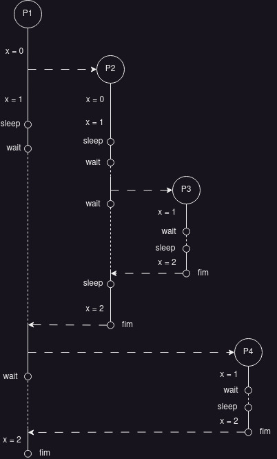

# Exercícios Capítulo 5 

O estado de uma tarefa em um determinado
instante é denominado **contexto**.

O ato de suspender uma tarefa e reativar outra é denominado uma **troca de contexto**.

**Despachante** ou executivo (*dispatcher*) é um conjunto de rotinas que provê armazenamento e recuperação do contexto e a atualização das informações contidas no TCB de cada tarefa. `Mecanismos`

**Escalonador** (*scheduler*) responsável pela escolha da próxima tarefa a receber o processador a cada troca de contexto. Considera influências de diversos fatores, como as prioridades, os tempos de vida e os tempos de processamento restante de cada tarefa. `Política`

## 1 - Explique o que é, para que serve e o que contém um TCB - Task Control Block

TCB é um descritor, ou seja, uma estrutura de dados no núcleo que representa essa tarefa. Nessa estrutura de dados são armazenadas as informações relativas ao seu contexto e os demais dados necessários à sua gerência, como prioridades, estado, etc

## 2 - Desenhe o diagrama de tempo da execução do código a seguir, informe qual a saída do programa na tela (com os valores de x) e calcule a duração aproximada de sua execução.

```c
int main() {
    int x = 0 ;
    fork () ;
    x++ ;
    sleep (5) ;
    wait (0) ;
    fork () ;
    wait (0) ;
    sleep (5) ;
    x++ ;
    printf ("Valor de x: %d\n", x) ;
}
```



## 3 - Indique quantas letras “X” serão impressas na tela pelo programa abaixo quando for executado com a seguinte linha de comando: 

```bash
a.out 4 3 2 1 
```

## O comando a.out resulta da compilação do programa a seguir:

```c
#include <stdio.h>
#include <sys/types.h>
#include <unistd.h>
#include <stdlib.h>

int main(int argc, char *argv[])
{
    pid_t pid[10];
    int i;

    int N = atoi(argv[argc - 2]);

    for (i = 0; i < N; i++)
        pid[i] = fork();

    if (pid[0] != 0 && pid[N - 1] != 0) 
        pid[N] = fork();

    printf("X");
    return 0;
}
```

A letra "X" será impressa 5 vezes. Devido ao fluxo:

* o processo pai cria 2 filhos (pid[0] e pid[1])
* como pid[0] e pid[1] são ambos diferentes de 0, o processo pai cria mais um filho (pid[2])
* como o filho pid[0] foi criado dentro do laço de repetição, ele cria mais um filho no lugar de pid[1]
* ao todo serão 4 filhos (4 forks)
* o processo pai imprime a letra "X" e cada processo filho imprime uma letra "X"
* logo serão impressas 5 letras "X"
