# Exercícios Capítulo 6

## 1 - Explique o que é escalonamento *round-robin*, dando um exemplo.

O escalonamento *round-robin* é um modelo que segue a política de escalonamento do FCFS (First-Come, First Served) com a adição da preempção por tempo. É conhecido como escalonamento por revezamento, o tempo que o algoritmo usa para fazer a preempção é chamado de *quantum*.

Além disso, o RR segue a sequência de tarefas prontas no sistema, ou seja, executa aquelas que estão esperando por mais tempo. Um exemplo pode ser encontrado na Figura 6.2 do livro.

## 2. Considere um sistema de tempo compartilhado com valor de quantum *tq* e duração da troca de contexto *ttc*. Considere tarefas de entrada/saída que usam em média *p%* de seu quantum de tempo cada vez que recebem o processador. Defina a eficiência *E* do sistema como uma função dos parâmetros *tq*, *ttc* e *p*.

E = tempo de processamento / (tempo de processamento + tempo de espera + tempo de troca de contexto)

E  = (n x p% x tq) / ((n x p% x tq) + (m x tq) + (n x ttc))

Onde:
* *n* é o número de tarefas em execução;
* *p%* é a porcentagem do quantum de tempo utilizado por cada tarefa de entrada/saída;
* *tq* é o valor do quantum;
* *m* é o número de tarefas em espera;
* *ttc* é o tempo de troca de contexto.

Ignorando o tempo de espera, temos:

```
E = n x p% x tq / (n x p% x tq + n x ttc)
```

## 3 - Explique o que é, para que serve e como funciona a técnica de *aging*.

Para evitar a inanição (*starvation*) das tarefas de menor prioridade, um fator interno denominado envelhecimento (aging) deve ser definido. O envelhecimento aumenta a prioridade da tarefa proporcionalmente ao tempo que ela está aguardando o processador. Dessa forma, o envelhecimento define um esquema de prioridades dinâmicas, que permite a elas executar periodicamente e assim evitar a inanição.

## 4 - No algoritmo de envelhecimento definido na Seção 6.4.6, o que seria necessário modificar para suportar uma escala de prioridades negativa?

Deveríamos mudar a linha de escolha da nova tarefa e trocar a função *max* para *min* na seleção da tarefa por prioridade.

## 5 - A tabela a seguir representa um conjunto de tarefas prontas para utilizar um processador:

Represente graficamente a sequência de execução das tarefas e calcule os tempos médios de vida (*tournaround time*) e de espera (*waiting time*), para as políticas de escalonamento a seguir:

|   **Tarefa**   | **_t1_** | **_t2_** | **_t3_** | **_t4_** | **_t5_** |
|:--------------:|:--------:|----------|----------|----------|----------|
|  **ingresso**  |     0    |     0    |     3    |     5    |     7    |
|   **duraçao**  |     5    |     4    |     5    |     6    |     4    |
| **prioridade** |     2    |     3    |     5    |     9    |     6    |


### (a) FCFS cooperativa

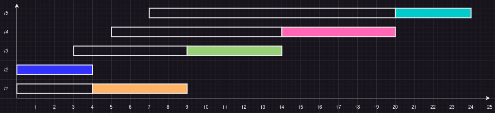

* Tournaround time médio:

```
Tt = ((9 - 0) + (4 - 0) + (14 - 3) + (20 - 5) + (24 - 7)) / 5 = 11.5
```

* Waiting time médio:

```
Tw = ((4 - 0) + (0 - 0) + (9 - 3) + (14 - 5) + (20 - 7)) / 5 = 6.4
```

### (b) SJF cooperativa

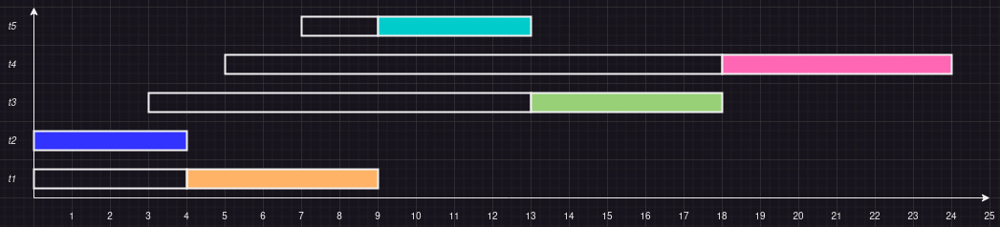

* Tournaround time médio:

```
Tt = ((9 - 0) + (4 - 0) + (18 - 3) + (24 - 5) + (13 - 7)) / 5 = 10.6
```

* Waiting time médio:

```
Tw = ((4 - 0) + (0 - 0) + (13 - 3) + (18 - 5) + (9 - 7)) / 5 = 5.8
```
### (c) SJF preemptiva (SRTF)


* Tournaround time médio:

```
Tt = ((9 - 0) + (4 - 0) + (18 - 3) + (24 - 5) + (13 - 7)) / 5 = 10.6
```

* Waiting time médio:

```
Tw = ((4 - 0) + (0 - 0) + (13 - 3) + (18 - 5) + (9 - 7)) / 5 = 5.8
```

### (d) PRIO cooperativa

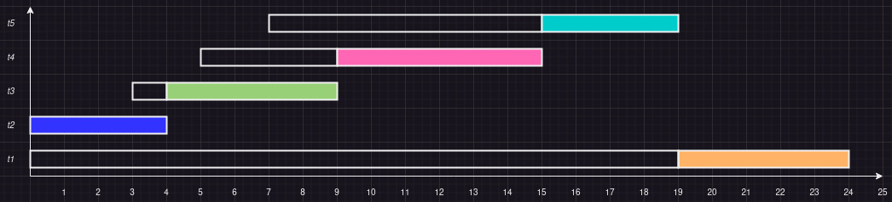

* Tournaround time médio:

```
Tt = ((24 - 0) + (4 - 0) + (9 - 3) + (15 - 5) + (19 - 7)) / 5 = 11.2
```

* Waiting time médio:

```
Tw = ((19 - 0) + (0 - 0) + (4 - 3) + (9 - 5) + (15 - 7)) / 5 = 6.4
```

### (e) PRIO preemptiva

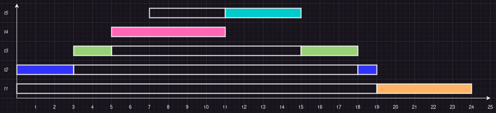

* Tournaround time médio:

```
Tt = ((24 - 0) + (19 - 0) + (18 - 3) + (11 - 5) + (15 - 7)) / 5 = 14.4
```

* Waiting time médio:

```
Tw = (19 + 15 + 10 + 0 + 4) / 5 = 9.6
```

### (f) RR com tq = 2, sem envelhecimento

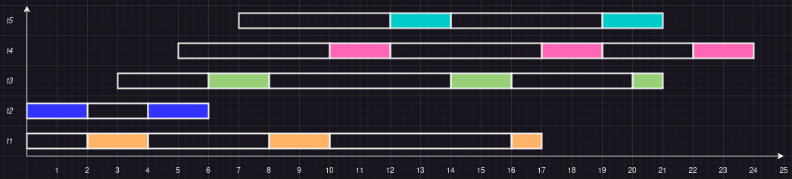

* Tournaround time médio:

```
Tt = ((17 - 0) + (6 - 0) + (21 - 3) + (24 - 5) + (21 - 7)) / 5 = 14.8
```

* Waiting time médio:

```
Tw = (12 + 2 + 13 + 13 + 10) / 5 = 10
```

## 6 - Idem, para as tarefas a seguir:

|   **Tarefa**   | **_t1_** | **_t2_** | **_t3_** | **_t4_** | **_t5_** |
|:--------------:|:--------:|----------|----------|----------|----------|
|  **ingresso**  |     0    |     0    |     1    |     7    |    11    |
|   **duraçao**  |     5    |     6    |     2    |     6    |     4    |
| **prioridade** |     2    |     3    |     4    |     7    |     9    |

### (a) FCFS cooperativa

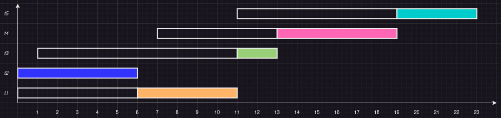

* Tournaround time médio:

```
Tt = ((11 - 0) + (6 - 0) + (13 - 1) + (19 - 7) + (23 - 11)) / 5 = 10.6
```

* Waiting time médio:

```
Tw = ((5 - 0) + (0 - 0) + (11 - 1) + (13 - 7) + (20 - 11)) / 5 = 6
```

### (b) SJF cooperativa

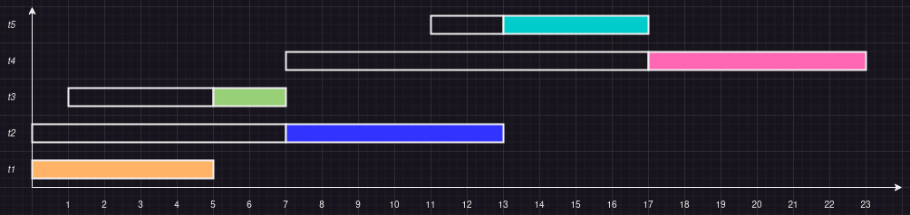

* Tournaround time médio:

```
Tt = ((5 - 0) + (13 - 0) + (7 - 1) + (23 - 7) + (17 - 11)) / 5 = 9.2
```

* Waiting time médio:

```
Tw = (0 + 7 + 4 + 10 + 2) / 5 = 4.6
```


### (c) SJF preemptiva (SRTF)

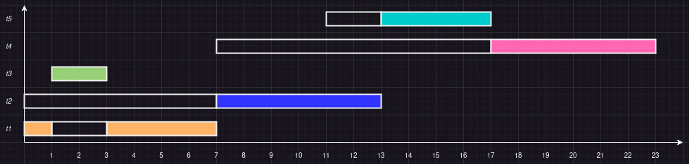

* Tournaround time médio:

```
Tt = ((7 - 0) + (13 - 0) + (3 - 1) + (23 - 7) + (17 - 11)) / 5 = 8.8
```

* Waiting time médio:

```
Tw = (2 + 7 + 0 + 10 + 2) / 5 = 4.2
```

### (d) PRIO cooperativa

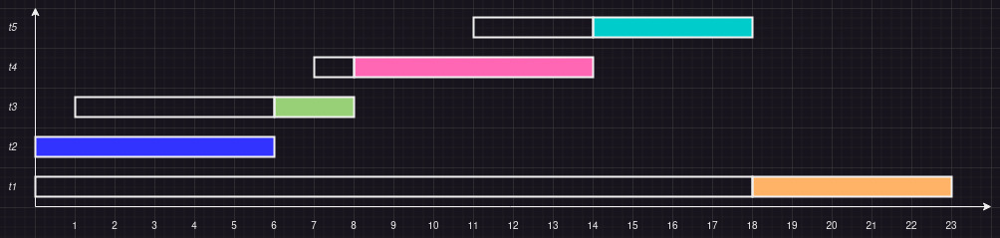

* Tournaround time médio:

```
Tt = ((23 - 0) + (6 - 0) + (8 - 1) + (14 - 7) + (18 - 11)) / 5 = 10
```

* Waiting time médio:

```
Tw = (18 + 0 + 5 + 1 + 3) / 5 = 5.4
```

### (e) PRIO preemptiva

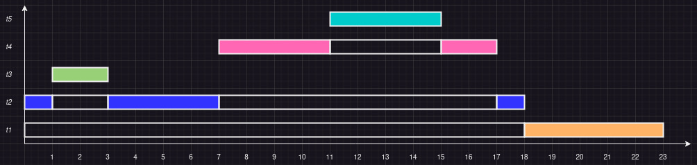

* Tournaround time médio:

```
Tt = ((23 - 0) + (18 - 0) + (3 - 1) + (17 - 7) + (15 - 11)) / 5 = 11.4
```

* Waiting time médio:

```
Tw = (18 + 12 + 0 + 4 + 0) / 5 = 6.8
```

### (f) RR com tq = 2, sem envelhecimento

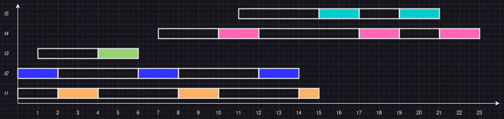

* Tournaround time médio:

```
Tt = ((15 - 0) + (14 - 0) + (6 - 1) + (23 - 7) + (21 - 11)) / 5 = 12
```

* Waiting time médio:

```
Tw = (10 + 8 + 3 + 10 + 6) / 5 = 7.4
```


