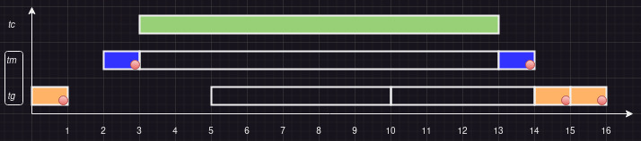
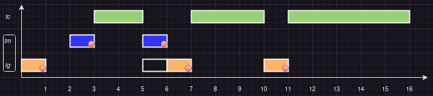

# Exercícios Capítulo 7

## 1 - Explique os conceitos de inversão e herança de prioridade

A **inversão de prioridade** é um problema que pode ocorrer em sistemas com escalonamento por prioridade, onde uma tarefa de prioridade mais baixa pode bloquear uma tarefa de prioridade mais alta, impedindo que esta execute. 

Isso ocorre quando uma tarefa de prioridade mais alta está bloqueada esperando por um recurso de **exclusão mútua** (só pode ser usado por uma tarefa de cada vez) que está sendo usado por uma tarefa de prioridade mais baixa. 

A **herança de prioridade** é um protocolo que evita a inversão de prioridade, onde a tarefa de prioridade mais baixa herda a prioridade da tarefa de prioridade mais alta que está bloqueada.

Com isso, a tarefa de prioridade mais baixa pode executar e liberar o recurso de exclusão mútua, permitindo que a tarefa de prioridade mais alta tenha acesso ao recurso e execute.

## 2 - O sistema operacional da sonda Mars Pathfinder (Seção 7.1) usa escalonamento por prioridades preemptivo, sem envelhecimento e sem compartilhamento de tempo. Suponha que as tarefas *tg* e *tm* detêm a área de transferência de dados durante todo o período em que executam. Os dados de um trecho de execução das tarefas são indicados na tabela a seguir (observe que *tg* executa mais de uma vez). (a) Desenhe o diagrama de tempo da execução sem e (b) com o protocolo de herança de prioridades e discuta sobre as diferenças observadas entre as duas execuções.

| **Tarefa** | **_Tg_** | **_Tm_** | **_Tc_** |
|------------|----------|----------|----------|
| ingresso   | 0, 5, 10 | 2        | 3        |
| duração    | 1        | 2        | 10       |
| prioridade | alta     | baixa    |  média   |

### (a) Sem herança de prioridade

### (b) Com herança de prioridade

